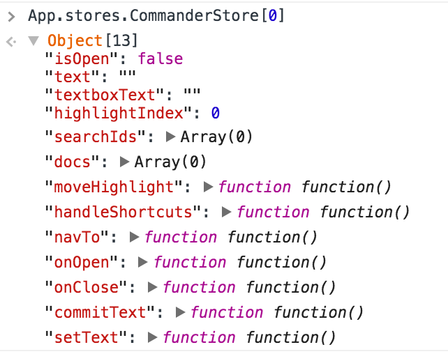

# mobx formatters for chrome



[](https://badge.fury.io/js/mobx-formatters)
[](https://www.npmjs.com/package/mobx-formatters)
[](https://david-dm.org/andrewdavey/mobx-formatters#info=devDependencies)

[Mobx](https://mobx.js.org/) is fantastic, but inspecting mobx collections in Chrome's Dev Tools is awkward. You only see the internal data structure, not the logical contents. For example, when inspecting the contents of an Mobx Object, you'd really like to see the items in the list.

Chrome (v47+) has support for custom "formatters". A formatter tells Chrome's Dev Tools how to display values in the Console, Scope list, etc. This means we can display Lists, Maps and other collections, in a much better way.

This library provides a formatter to do just that.


## Features

The library currently has formatters for:

 - [x] `Object`
 - [x] `Array`

Want something more? [Write down your wishes!](https://github.com/andrewdavey/mobx-formatters/issues/new)

## Installation

Chrome v47+

In Dev Tools, press F1 to load the Settings. Scroll down to the Console section and tick "Enable custom formatters".

Then, in your project, install via npm:

```
npm install --save-dev mobx-formatters
```

And enable with:

```js
var Mobx = require('mobx')
var mobxFormatters = require('mobx-formatters')

mobxFormatters(Mobx)
```

Note: You probably only want this library for debug builds, so perhaps wrap with `if (DEBUG) {...}` or similar.

## Chrome Extension

Would be awesome if someone helped create a Chrome Extension to automatically do this.

It could even be bundled with [this extension](https://chrome.google.com/webstore/detail/mobx-developer-tools/pfgnfdagidkfgccljigdamigbcnndkod/related).

## Using with webpack

You could use `webpack.DefinePlugin` to create a condition that will be allowed to install `mobx-formatters` in the debug build but unreachable in the production build:

```javascript
// webpack.config.js
var webpack = require('webpack')
module.exports = {
  // ...
  plugins: [
    new webpack.DefinePlugin({
      __DEV__: JSON.stringify(process.env.NODE_ENV !== 'production')
    })
  ],
};
```

In your source you'd have something like this...

```javascript
// index.js
var mobx = require('mobx');
if (__DEV__) {
  var installDevTools = require('mobx-formatters')
  installDevTools(mobx)
}
```

And then by adding the `-p` shortcut to webpack for production mode which enables dead code elimination, the condition that requires mobx-formatters will be removed.

```
NODE_ENV=production webpack -p index.js
```


## Credit

All credit for the initial code and readme goes to Andrew Davey and [this repo](https://github.com/andrewdavey/immutable-devtools). Thank you.
